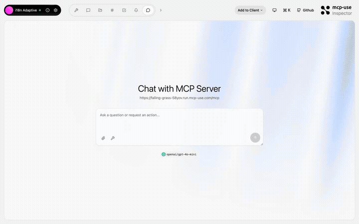
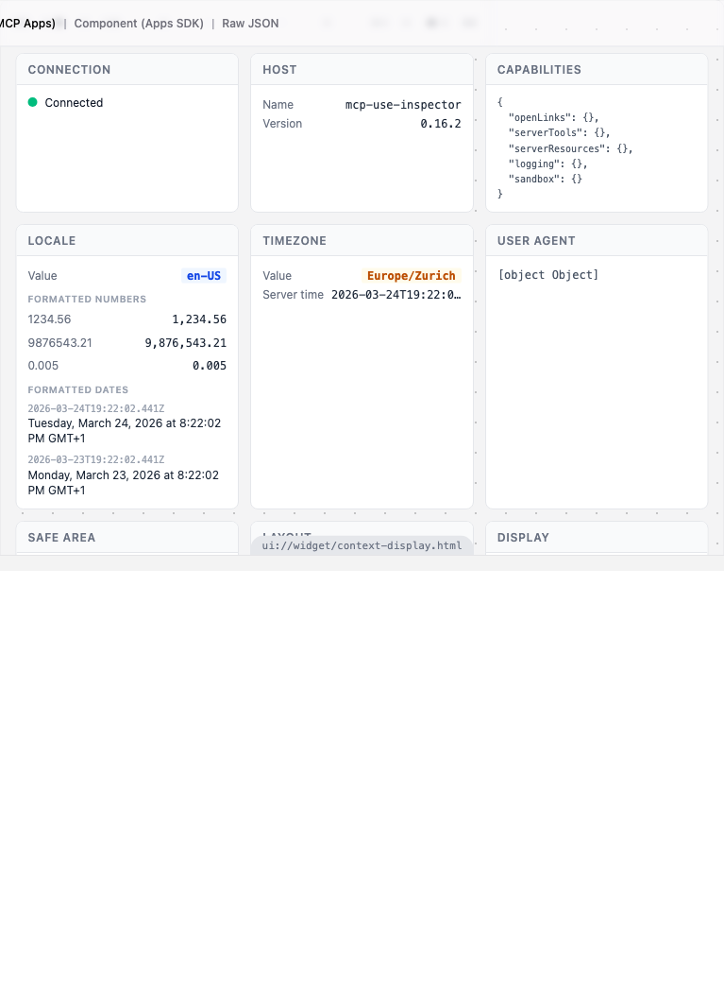

# i18n Adaptive — Multilingual adaptive context

<p>
  <a href="https://github.com/mcp-use/mcp-use">Built with <b>mcp-use</b></a>
  &nbsp;
  <a href="https://github.com/mcp-use/mcp-use">
    
  </a>
</p>

Showcase of adaptive context awareness. The server detects the connected client (ChatGPT, Claude, Inspector), reads user agent info, locale, viewport, safe area insets, and dynamically adapts its responses and widget rendering.



## Try it now

Connect to the hosted instance:

```
https://falling-grass-58yov.run.mcp-use.com/mcp
```

Or open the [Inspector](https://inspector.manufact.com/inspector?autoConnect=https%3A%2F%2Ffalling-grass-58yov.run.mcp-use.com%2Fmcp) to test it interactively.

### Setup on ChatGPT

1. Open **Settings** > **Apps and Connectors** > **Advanced Settings** and enable **Developer Mode**
2. Go to **Connectors** > **Create**, name it "i18n Adaptive", paste the URL above
3. In a new chat, click **+** > **More** and select the i18n Adaptive connector

### Setup on Claude

1. Open **Settings** > **Connectors** > **Add custom connector**
2. Paste the URL above and save

## Features

- **Client detection** — identify ChatGPT, Claude, or Inspector
- **User agent parsing** — read OS, browser, device type
- **Locale awareness** — detect user's preferred language
- **Viewport & safe area** — adapt to screen size and safe area insets
- **Context widget** — rich display of all detected client info

## Tools

| Tool | Description |
|------|-------------|
| `show-context` | Display all detected client context in a rich widget |
| `detect-caller` | Return raw client detection data as text |

## Available Widgets

| Widget | Preview |
|--------|---------|
| `context-display` |  |

## Local development

```bash
git clone https://github.com/mcp-use/mcp-i18n-adaptive.git
cd mcp-i18n-adaptive
npm install
npm run dev
```

## Deploy

```bash
npx mcp-use deploy
```

## Built with

- [mcp-use](https://github.com/mcp-use/mcp-use) — MCP server framework

## License

MIT
